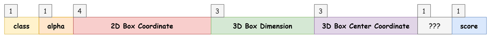
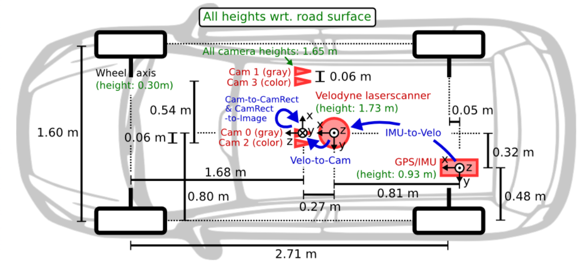
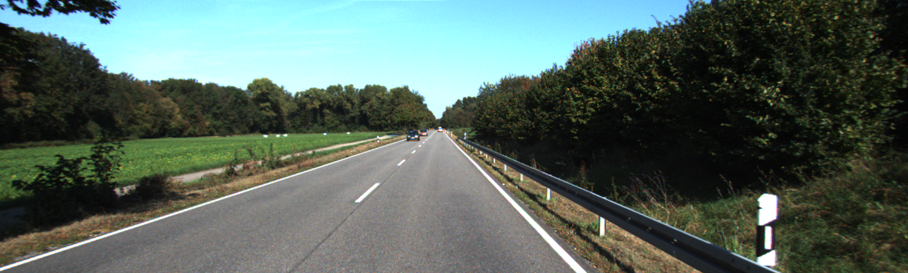
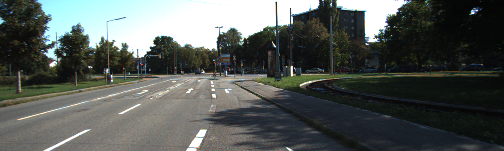
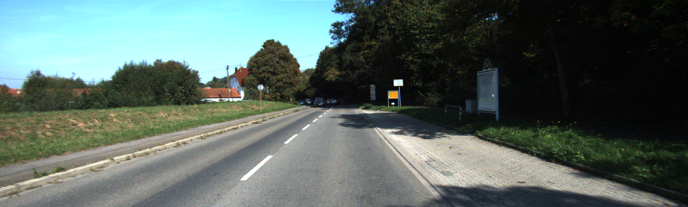
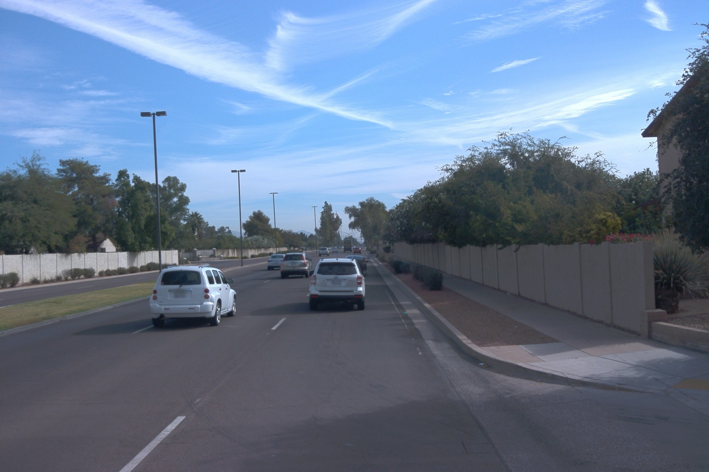
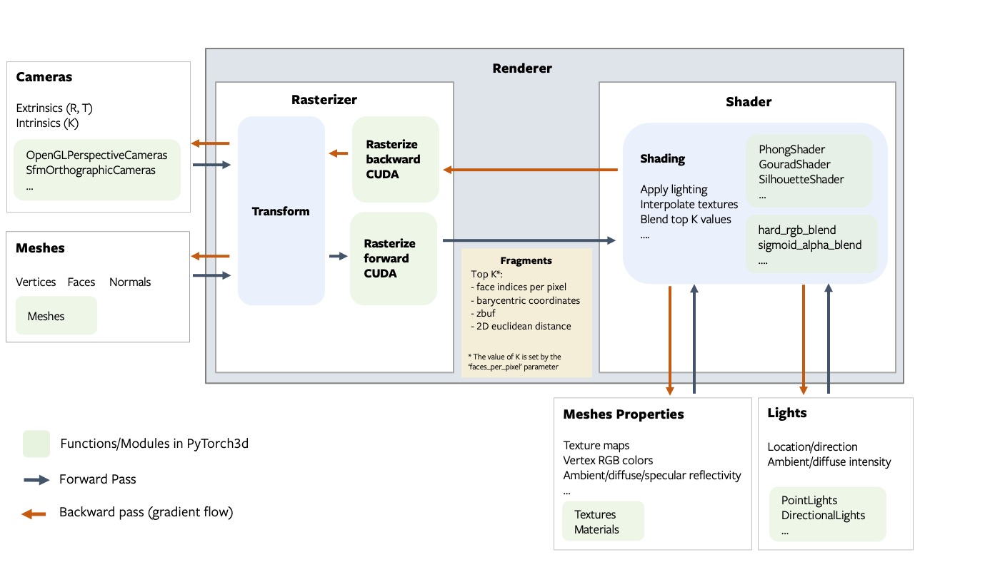
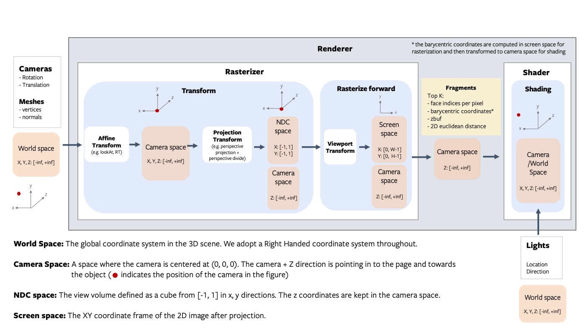
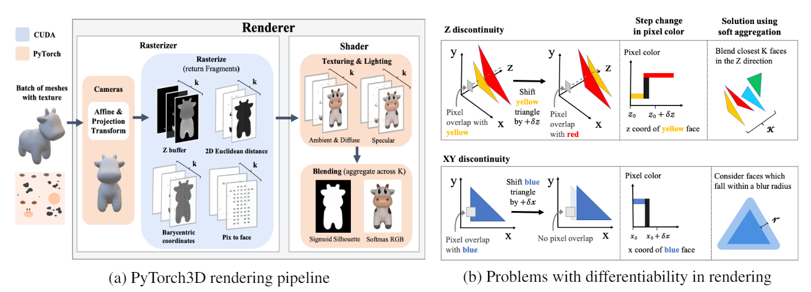
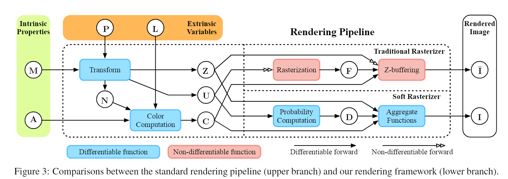

# Smoke-ADV 

---
### 1. Smoke Model Loader & Extractor

---
- Model Input
  - Smoke模型输入有三个，分别为大小为960*640的图像tensor、相机的内参矩阵K、
    以及图片缩放率down_ratio(建议是整数，即960\*640的整数倍)。
- Model Output
  - 
  - class 为识别的类别：0: "CAR", 1: "CYCLIST", 2: "PEDESTRIAN"
  - alpha 对应绕相机y轴的旋转角，对应alpha_z
  - 2D Box Coordinate 为2D Box的left_top和right_bottom坐标
  - 3D Box Dimension 对应3D Box的h、l、w
  - 3D Box Center Coordinate 对应车底盘中心点在相机坐标系下的坐标，注意不是车体中心点
  - 倒数第二维可能是预测2D与3D中心点偏移量？
  - score 对应识别物体的置信度

### 2. Kitti/Waymo Dataset Scenarios

---
- Note
- kitti dataset
  - setting
    - 
  - kitti scenarios
    - 
    - 
    - 
- waymo dataset
  - setting
  404 NOT FOUND
  - waymo scenarios
    - 

### 3. Differentiable Rendering

---
- Note

- Coordinate System Define
  - 
  
  - World Coordinate
    - 因为Waymo Open Dataset暂时找不到传感器之间详细的位置关系，所以暂时
    
      - 参考kitti设置
    
      - ```
        # from rear to front
        #        ^ y    
        #        |       
        #      z ⊙--> x
        ```
    
      - 参考smoke模型输出结果，方便获得3D GT信息
    
      - ```
    
  - Camera Coordinate
  
    - ```
      # from rear to front
      #        ^ y
      #        |
      #  x <-- ⊕ z
      ```
  
  - Image Coordinate
  
- Pytorch 3D
  - 
  - 
  - 
  
- 
  - shading分为phong和gouraud两种方法
    - gouraud先计算三角形顶点光照和着色，插值计算三角形区域其他像素着色。
    - phong对像素附近顶点法向量进行插值计算，最后用像素法向量和光照计算着色。
  - shader pytorch3d有5种：分别对应soft和hard的phong与gouraud，以及轮廓渲染。soft与hard区别于是否使用概率图计算最后像素颜色还是只取最近的三角形像素颜色。soft有两个参数$$\sigma $$和$$\gamma$$，分别控制渲染的尖锐程度与透明度。

### 4. Pipeline

---

- Types:

  - scenario: vis scenario

    - ```yaml
      enable:
        object: false
        stickers: false
        scenario: true
        renderer: false
        smoke: false
        attack: false
        logger: true

  - scenario detection: the detection outcomes of scenario without any renderer

    - ```yaml
      enable:
        object: false
        stickers: false
        scenario: true
        renderer: false
        smoke: true
        attack: false
        logger: true

  - renderer: vis render outcomes
  
    - ```yaml
      enable:
        object: true
        stickers: false
        scenario: true
        renderer: true
        smoke: false
        attack: false
        logger: true

  - renderer in scenario detection: the detection outcomes of render in scenario outcomes
  
    - ```yaml
      enable:
        object: true
        stickers: false
        scenario: true
        renderer: true
        smoke: true
        attack: false
        logger: true
      ```
  
  - render with stickers in scenario detection:
  
    - ```yaml
      enable:
        object: true
        stickers: true
        scenario: true
        renderer: true
        smoke: true
        attack: false
        logger: true
  
  - attack: whole attack pipeline
  
    - ```yaml
      enable:
        object: true
        stickers: true
        scenario: true
        renderer: true
        smoke: true
        attack: true
        logger: true
  
  - defense: whole defense pipeline
  
    - ```yaml
